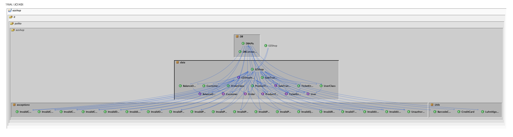
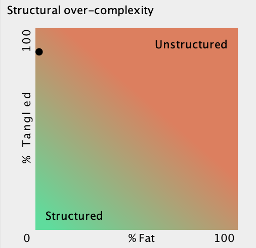
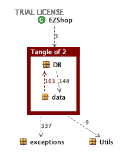
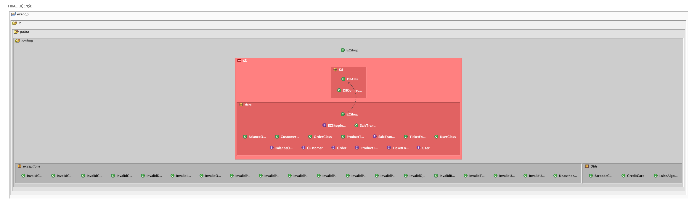

# Design assessment


```
<The goal of this document is to analyse the structure of your project, compare it with the design delivered
on April 30, discuss whether the design could be improved>
```

# Levelized structure map
```
<Applying Structure 101 to your project, version to be delivered on june 4, produce the Levelized structure map,
with all elements explosed, all dependencies, NO tangles; and report it here as a picture>
```


Note: the structure breakdown is at class level, since eploding classes exposing methods will result in a difficult to read graph

# Structural over complexity chart
```
<Applying Structure 101 to your project, version to be delivered on june 4, produce the structural over complexity chart; and report it here as a picture>
```




# Size metrics

```
<Report here the metrics about the size of your project, collected using Structure 101>
```


| Metric                                    | Measure |
| ----------------------------------------- | ------- |
| Packages                                  | 7       |
| Classes (outer)                           | 41        |
| Classes (all)                             | 41        |
| NI (number of bytecode instructions)      | 8883        |
| LOC (non comment non blank lines of code) | 3820        |


# Items with XS

```
<Report here information about code tangles and fat packages>
```

| Item | Tangled | Fat  | Size | XS   |
| ---- | ------- | ---- | ---- | ---- |
| ezshop.it.polito.ezshop     |  17%       | 5     |  8883    |  1524    |


# Package level tangles

```
<Report screen captures of the package-level tangles by opening the items in the "composition perspective" 
(double click on the tangle from the Views->Complexity page)>
```

Here are reported both the package-level tangles as required, first stcreenshot, and the class level tangle, to better show how the only backward dependency is between EZShop class and DBAPIs class




# Summary analysis
```
<Discuss here main differences of the current structure of your project vs the design delivered on April 30>
<Discuss if the current structure shows weaknesses that should be fixed>
```

### Differences between current and planned design
The main difference between the current structure and the one delivered is due to support structures that were added:
a simple example is the utils package.
At the same time a more important and impacting example is the DBAPIs class, that is linked with almost every other class of the project, and that has been used as unique connection with the underlying database.

### Structure Weaknesses
The current structure shows a high tangle level (95%), with a 0% fat.
From the graph it is shown that this is due to some methods inside DBAPIs that calls classes (e.g. ProductTypeClass), which are called also by EZShop and other classes inside the data package itself.
Structure101 also gives a warning for the dependency that goes from EZShop to DBAPIs, since the latter is identified with a higher "graphical" hierarchy.
The point here is that DBAPIs in practise is a class that should be located between EZShop and the underlying classes, as a support class created to work in synergy with EZShop class.

### Possible solutions
One possible solution to bring down the tangle level could be moving the DB calls from a dedicated API directly into the single classes and their methods, avoiding backward dependencies.
