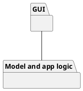

# Design Document 


Authors: Simone Alberto, Marco Barca, Umberto Ferrero, Gabriele Vernetti

Date: 12/06/2021

Version: 2.0

Edits:
 - 2.0:
    - updated low level design, extracting the final one from the code (without interfaces)
    - updated traceability matrix
    - updated sequence diagrams according to the latest implementation, and taking into condideration RFID management


# Contents
- [High level design](#package-diagram)
- [Low level design](#class-diagram)
- [Verification traceability matrix](#verification-traceability-matrix)
- [Verification sequence diagrams](#verification-sequence-diagrams)

# Instructions
The design must satisfy the Official Requirements document, notably functional and non functional requirements

# High level design 
We use a Multilayer architectural pattern; we have two packages for dividing the logic between the GUI and Business logic.



# Low level design

Notes:
 - design extracted from the final code
 - interfaces have been excluded for readability
 - other auxiliary functions (such as checks on barcodes) have been omitted


# Verification traceability matrix
| FR ID | User | EZShop | SaleTransaction | BalanceOperation | Customer | Order |  ProductType | TicketEntry |
| --- | - | - | - | - | - | - | - | - |
| FR1 | x | x |   |   |   |   |   |   |
| FR3 | x | x |   |   |   |   | x |   |
| FR4 | x | x |   | x |   | x | x |   |
| FR5 | x | x |   |   | x |   |   |   |   
| FR6 | x | x | x | x | x |   | x | x |
| FR7 | x | x | x | x | x |   | x | x |
| FR8 | x | x |   |   | x |   |   |   |


# Verification sequence diagrams 

### Sequence Diagram 1 - Manage users and rights (users are Administrator, ShopManager, Cashier)
```plantuml
Administrator -> EZShop: 1: Open Settings
EZShop -> DBAPIs: 2: getAllUsers()
DBAPIs -> DBAPIs: 3: getAllUsers()
Administrator <-- EZShop: 4: return getAllUsers()
Administrator -> EZShop: 5: Select User to manage
EZShop -> DBAPIs: 6: getUserFromId()
DBAPIs -> DBAPIs: 7: getUserFromId()
DBAPIs -> EZShop: 8: getUserFromId()
Administrator <-- EZShop: 9: return getUser()
Administrator -> EZShop: 10: Update user rights
EZShop -> DBAPIs: 11: updateUserRights()
DBAPIs -> DBAPIs: 12:  updateUserRights()
EZShop <- DBAPIs: 13: Successfull message
Administrator <- EZShop: 14: Successfull message
```
### Sequence Diagram 3 - Manage product catalog (Scenario 3.1)
```plantuml
Manager -> EZShop: 1: Select Add product
EZShop -> DBAPIs: 2: createProductType()
DBAPIs -> DBAPIs: 3: getProductTypeCount()
DBAPIs -> DBAPIs: 4: createProductType()
EZShop <-- DBAPIs: 5: return createProductType()
Manager <-- EZShop: 6: Successfull message
```
### Sequence Diagram 4 - Manage Inventory (Scenario 4.1)
```plantuml
Manager -> EZShop: 1: Select Product
EZShop -> DBAPIs: 2: getProductTypeByBarCode()
EZShop <-- DBAPIs: 3: return getProductTypeByBarCode()
Manager <-- EZShop: 4: Return Product
Manager --> EZShop: 5: Update Position
EZShop --> DBAPIs: 6: updatePosition()
DBAPIs --> DBAPIs: 7: getProductTypeFromId()
DBAPIs --> DBAPIs: 8: updateProductTypePosition()
DBAPIs --> EZShop: 9: return updatePosition()
Manager <-- EZShop: 10: Successfull message
Manager -> EZShop: 11: Update product quantity
EZShop --> DBAPIs: 12: updateQuantity()
DBAPIs --> DBAPIs: 13: getProductTypeFromId()
DBAPIs --> DBAPIs: 14: updateProductTypeQuantity()
DBAPIs --> EZShop: 15: return updateQuantity()
Manager <-- EZShop: 16: Successfull message
```

### Sequence Diagram 5 - Manage customers and cards
```plantuml
Cashier -> EZShop: 1: Select Create New customer
EZShop -> DBAPIs: 2: defineCustomer()
DBAPIs -> DBAPIs: 3: createCustomer()
EZShop <-- DBAPIs: 4: return createCustomer()
Cashier <-- EZShop: 5: Successfull message
Cashier -> EZShop: 6: Select Modify Customer
EZShop -> DBAPIs: 7: modifyCustomer()
DBAPIs -> DBAPIs: 8: getCustomerFromId()
DBAPIs -> DBAPIs: 9: updateCustomer()
EZShop <-- DBAPIs: 10: return modifyCustomer()
Cashier <-- EZShop: 11: Successfull message
Cashier -> EZShop: 12: Select Create a Loyalty Card
EZShop -> EZShop: 13: createCard()
EZShop <-- EZShop: 14: return createCard()
Cashier <-- EZShop: 15: Successfull message
Cashier -> EZShop: 16: Select Attach Card to a Customer
EZShop -> DBAPIs: 17: attachCardToCustomer()
DBAPIs -> DBAPIs: 18: updateCustomerCard()
EZShop <-- DBAPIs: 19: return attachCardToCustomer()
Cashier <-- EZShop: 20: Successfull message
Cashier -> EZShop: 21: Select modify points on a card
EZShop -> DBAPIs: 22: modifyPointsOnCard()
DBAPIs -> DBAPIs: 23: getCustomerFromCard()
DBAPIs -> DBAPIs: 24: updatePointsOnCard()
EZShop <-- DBAPIs: 25: return modifyPointsOnCard()
Cashier <-- EZShop: 26: Successfull message
```

### Sequence Diagram 6 - Manage a sale transaction
```plantuml
Cashier -> EZShop: 1: Start a new sale
EZShop -> EZShop: 2: startSaleTransaction()
EZShop <-- EZShop: 3: return startSaleTransaction()
EZShop <-- EZShop: 4: Successfull message
Cashier -> EZShop: 5: Add product
EZShop -> DBAPIs: 6: addProductToSaleRFID()
DBAPIs -> DBAPIs: 7: getBarcodeFromRFID()
EZShop <- DBAPIs: 8: return addProductToSaleRFID()
Cashier <-- EZShop: 9: Successfull message
Cashier -> EZShop: 10: Close sale
EZShop -> DBAPIs: 11: endSaleTransaction()
DBAPIs -> DBAPIs: 12: createClosedSaleTransaction()
DBAPIs -> DBAPIs: 13: updateProductQuantity()
DBAPIs -> DBAPIs: 14: updateRFIDSold()
EZShop <- DBAPIs: 15: return endSaleTransaction()
Cashier <-- EZShop: 16: Successfull message
```

### Sequence Diagram 7 - Manage payment
```plantuml
Cashier -> EZShop: 1: Select credit card as payment type
EZShop -> EZShop: 2: receiveCreditCardPayment()
EZShop -> DBAPIs: 3: recordBalanceUpdate()
DBAPIs -> DBAPIs: 4: createBalanceOperation()
EZShop <-- DBAPIs: 5: Successfull message
```
 
### Sequence Diagram 8 - Accounting
```plantuml
Manager -> EZShop: 1: Select a start date
Manager -> EZShop: 2: Select an end date
EZShop -> DBAPIs: 3: getCreditsAndDebits()
DBAPIs -> DBAPIs: 4: getAllBalanceOperations()
EZShop <-- DBAPIs: 5: Return getAllBalanceOperations()
Manager <-- EZShop: 6: Return the transactions list
```
