# Graphical User Interface Prototype  

Authors: Simone Alberto, Marco Barca, Umberto Ferrero, Gabriele Vernetti

Date: 18/04/2021

Version: 1.0

# Contents

- [Use role sidebar views](#user-role-sidebar-views)
- [UC1 - Create new user](#uc1-create-new-user)
- [UC2 - Delete user](#uc2-delete-user)
- [UC3 - List all users](#uc3-list-all-users)
- [UC4 - Modify user role](#uc4-modify-user-role)
- [UC5 - Check aggregates on the analytics section](#uc5-check-aggregates-on-the-analytics-section)
- [UC6 - Create new Fidelity Card](#uc6-create-new-fidelity-card)
- [UC7 - Modify Fidelity Card data](#uc7-modify-fidelity-card-data)
- [UC8 - List all Fidelized Customers](#uc8-list-all-fidelized-customers)
- [UC9 - Search Fidelized Customer](#uc9-search-fidelized-customer)
- [UC10 - Sell a product](#uc10-sell-a-product)
	+ [Scenario 10.1 Nominal Scenario](#scenario-101-nominal-scenario)
	+ [Scenario 10.2 Error while scanning the Product](#scenario-102-error-while-scanning-the-product)
	+ [Scenario 10.3 Error while scanning the Fidelity Card](#scenario-103-error-while-scanning-the-fidelity-card)
	+ [Scenario 10.4 Credit Card payment](#scenario-104-credit-card-payment)
	+ [Scenario 10.5 Credit Card payment fail](#scenario-105-credit-card-payment-fail)
	+ [Scenario 10.6 Sale not bound to a Fidelity Card](#scenario-106-sale-not-bound-to-a-fidelity-card)
- [UC11 - Update products quantity during the sale](#uc11-update-products-quantity-during-the-sale)
- [UC12 - Cancel the sale made with cash payment](#uc12-cancel-the-sale-made-with-cash-payment)
- [UC13 - Cancel the sale made with credit card payment](#uc13-cancel-the-sale-made-with-credit-card-payment)
- [UC14 - Search Sale](#uc14-search-sale)
- [UC15 - Create new product](#uc15-create-new-product)
- [UC16 - Delete product from inventory](#uc16-delete-product-from-inventory)
- [UC17 - Modify product amount](#uc17-modify-product-amount)
- [UC18 - Modify product details](#uc18-modify-product-details)
- [UC19 - List all products](#uc19-list-all-products)
- [UC20 - Search product](#uc20-search-product)

# User role sidebar views

| Admin   | Manager | Worker |
| ----------- | ----------- | ----------- |
| 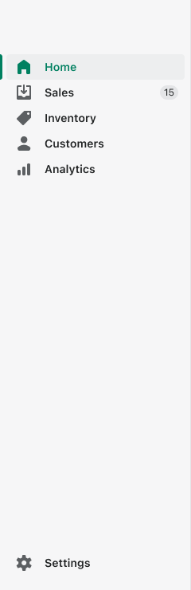 | 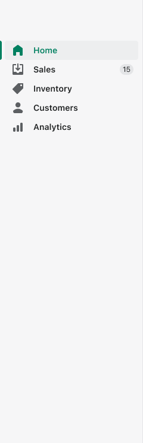 | 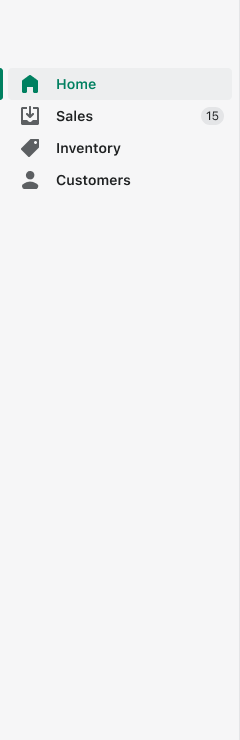 |

# UC1 - Create new user

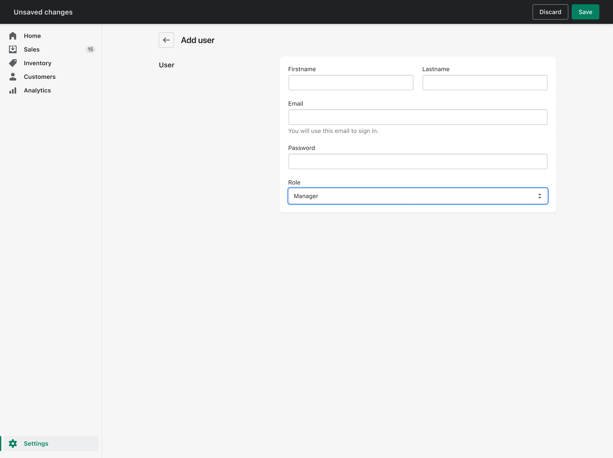

# UC2 - Delete user

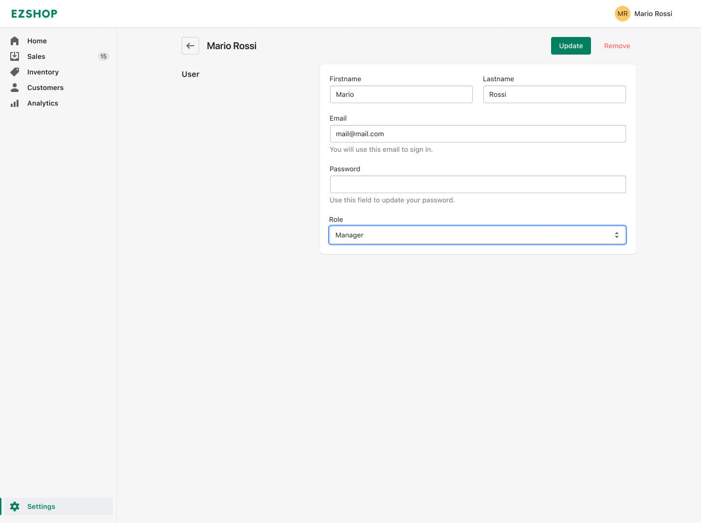
By pressing "Remove" the user is removed from the system.

# UC3 - List all users

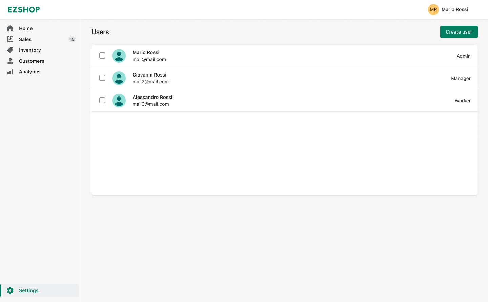

# UC4 - Modify user role

By selecting in the "Role" tab list the user role is updated.

# UC5 - Check aggregates on the analytics section

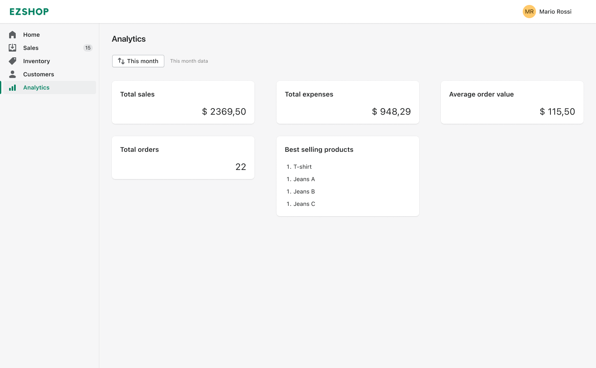

# UC6 - Create new Fidelity Card

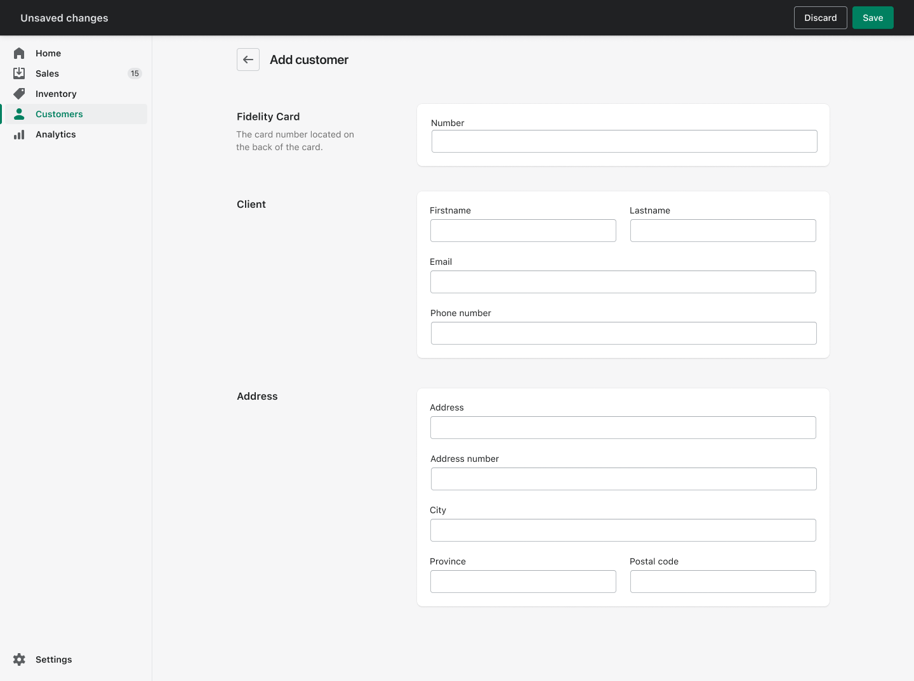

# UC7 - Modify Fidelity Card data
## Scenario 7.1 Physical Fidelity Card lost

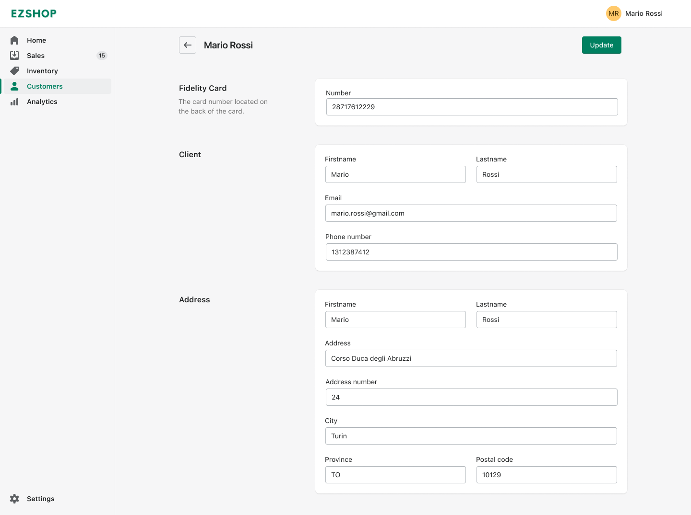

# UC8 - List all Fidelized Customers

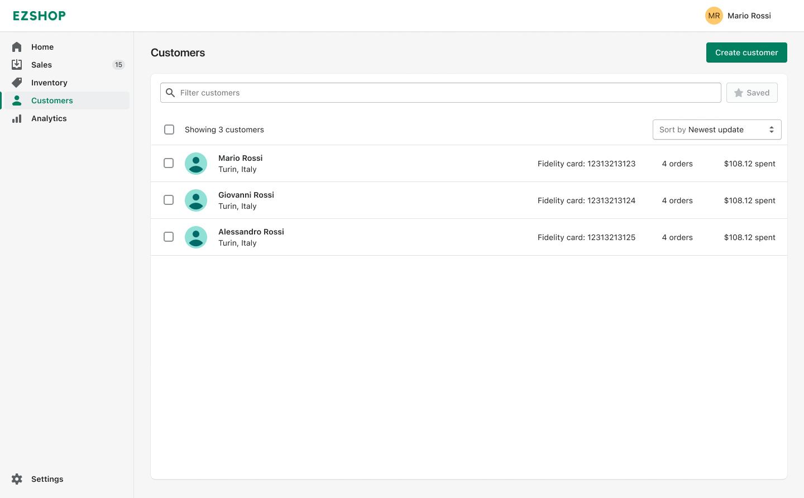

# UC9 - Search Fidelized Customer

By typing in the search box the fidelized customers list is updated.

# UC10 - Sell a product
## Scenario 10.1 Nominal Scenario

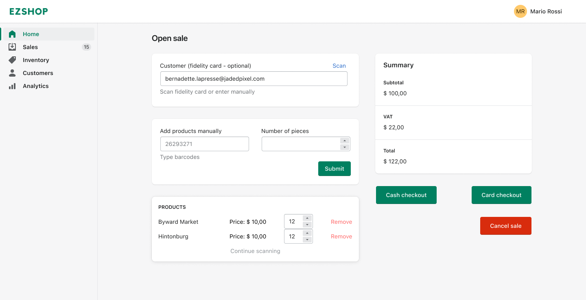

## Scenario 10.2 Error while scanning the Product

The user adds the barcode manually into the system.

## Scenario 10.3 Error while scanning the Fidelity Card

The user adds the Fidelity Card Code manually into the system.

## Scenario 10.4 Credit Card payment

The user selects the Credit Card payment and completes the checkout.

## Scenario 10.5 Credit Card payment fail

The POS signals to the user that the payment failed; the User selects the cash payment and completes the checkout.

## Scenario 10.6 Sale not bound to a Fidelity Card

# UC11 - Update products quantity during the sale

The user scans the first product and manually updates the quantity on screen instead of scanning multiple times.

# UC12 - Cancel the sale made with cash payment

The user presses the "Cancel sale" button.

# UC13 - Cancel the sale made with credit card payment

The user presses the "Cancel sale" button.

# UC14 - Search Sale

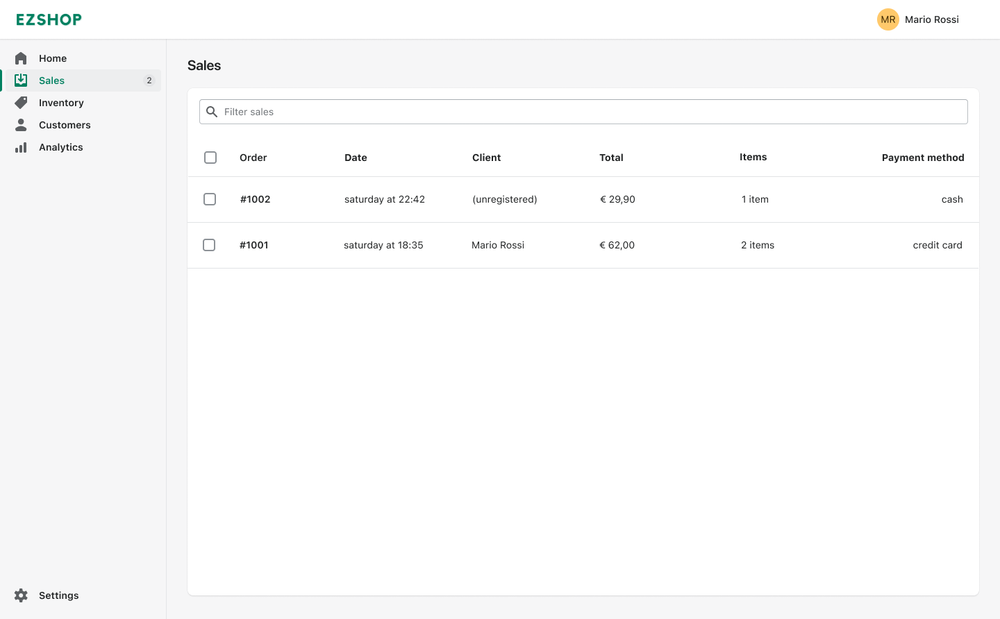
By typing in the search box the sales list is updated.

# UC15 - Create new product

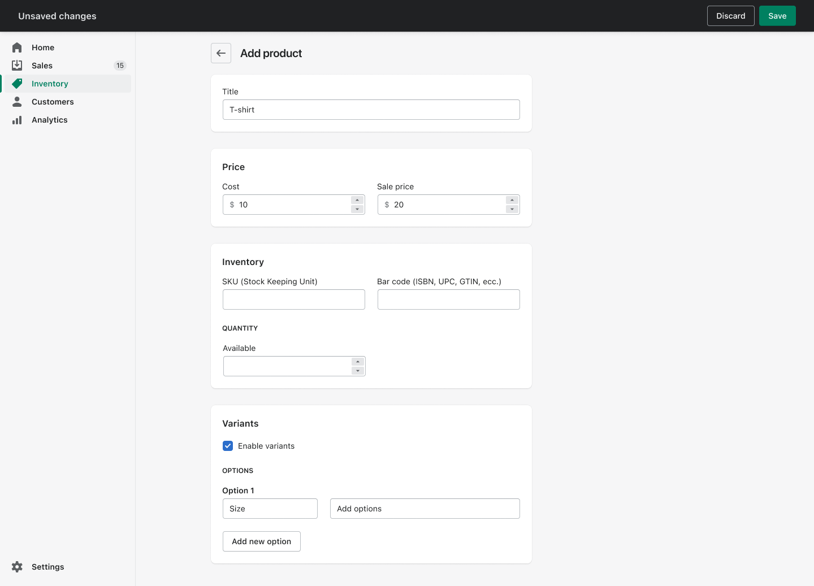

# UC16 - Delete product from inventory

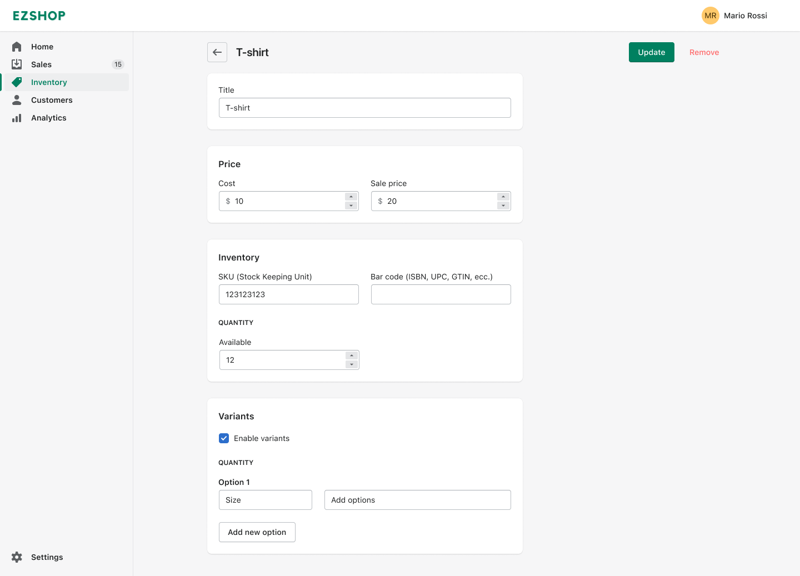
By pressing "Remove" the product is removed from the system.

# UC17 - Modify product amount

## Inventory section 
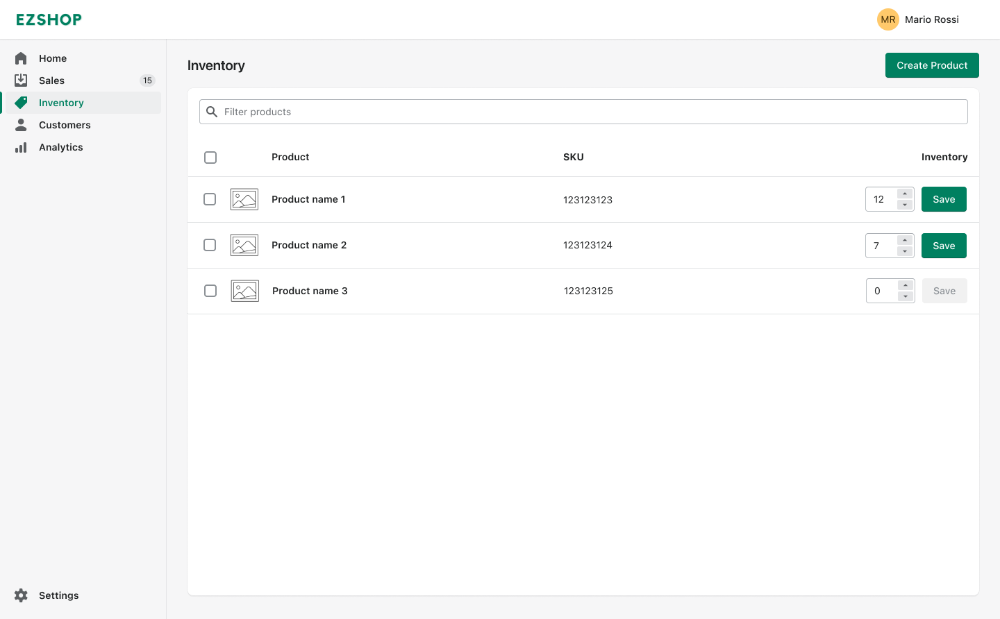
The user updates the quantity in the dedicated input box.

## Product page

The user updates the quantity in the dedicated input box.

# UC18 - Modify product details

# UC19 - List all products

# UC20 - Search product

By typing in the search box the products list is updated.
