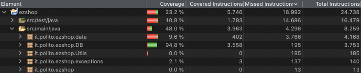

# Unit Testing Documentation

Authors: Simone Alberto, Marco Barca, Umberto Ferrero, Gabriele Vernetti

Date: 12/06/2021

Version: 2.0

Edits:
 - 2.0:
    - added last paragraph regarding the CR. Added the RFID methods inside the document.
    - updated the screenshot for test coverage: in the previous version the percentage was showing the total coverage (considering also the test code itself), not being representative of the real code coverage in this step. With this update the screenshot it is shown the detail at package level, and the relevant overall percentage, for it.polito.ezshop.db, is around 95%

# Contents

- [Black Box Unit Tests](#black-box-unit-tests)
    + [Class DBAPIs](#class-dbapis)
        - [Class DBAPIs - *get methods with no parameters*](#class-dbapis-get-methods-with-no-parameters)
        - [Class DBAPIs - *get methods with one parameter*](#class-dbapis-get-methods-with-one-parameter)
        - [Class DBAPIs - *"create" methods*](#class-dbapis-create-methods)
        - [Class DBAPIs - *"delete" methods*](#class-dbapis-delete-methods)
        - [Class DBAPIs - *"update" methods*](#class-dbapis-update-methods)
- [White Box Unit Tests](#white-box-unit-tests)
- [Change Request - Black Box Unit Tests](#change-request-black-box-unit-tests)

# Black Box Unit Tests
As per specific project design, 7 classes, reported under white box testing, only contains setters and getters methods, as all needed methods have been implemented in EZShop class.
Given that no particular conditions are required, and the conditions/constraits are applied at API level, only the JUnits have been created for these classes.

As anticipated EZShop contains all the "main" methods, hence it will be better analysed during integration tests, while most of the methods of DBAPIs.java, even if linked to other classes and quite out of scope for unit tests, will be discussed here since they are linked with a single "base" class. Again, given that all the constraints and parameters in input are checked in EZShop (as for example the length of barcode, or discount to be between 0 and 1), they are not reported here, while the boundaries are highlighted here for completeness, but not tested here since they are tested in the EZShop class.

To increase readibility of the document, Criteria, Predicates and in some cases boundaries will be reported as common to groups of methods.

 ### **Class DBAPIs**

 
### **Class *DBAPIs* - *get methods with no parameters***

For these classes no parameter in input is passed, it is not possible to do any reasoning on the prerequisites
The affected classes are:

- getBalanceOperationCount
- getClosedSaleTransactionCount
- getOrderCount
- getProductTypeCount
- getUserCount
- getAllBalanceOperations
- getAllOrders
- getAllProductTypes
- getAllUsers
- getReturnSaleTransactionCount
- getCustomerCount
- getCustomerCardMax
- getAllCustomers

### **Class *DBAPIs* - *get methods with one parameter***

**Criteria for methods with one parameter, usually the id/key:**	

 - Validity of parameter passed in input
 - Existence of parameter passed in input

**Predicates for methods with one parameter:**

| Criterion                     | Predicate |
| ------------------------------| --------- |
| Validity of parameter/object  | Valid     |
|                               | NULL      |
| Existence of parameter/object | Yes       |
|                               | No        |

**Boundaries for methods with one parameter:**

There are no particular boundaries, as the ID is used from a logical point of view, and not numerical

**Combination of predicates for methods with one parameter:**

| Validity of Item object | Existence of Item object | Valid / Invalid | Method | Description of the test case | JUnit Test Case |
|-------|-------|-------|-------|-------|-------|
| Valid | Yes | Valid |getClosedSaleTransactionPayed|T1(0) -> true|it.polito.ezshop.acceptanceTests.TestEZShop.testDBAPIsClosedSaleTransaction |
| * | No | Invalid | '' |T2(-1) -> false| |
| NULL | * | Invalid | '' |T3(null) -> null| |
| Valid | Yes | Valid |getReturnSaleTransactionPayed|T1(0) -> true|it.polito.ezshop.acceptanceTests.TestEZShop.testDBAPIsReturnSaleTransaction |
| * | No | Invalid | '' |T2(-1) -> false| |
| NULL | * | Invalid | '' |T3(null) -> null| |
| Valid | Yes | Valid |getOrderFromId|T1(0) -> Order|it.polito.ezshop.acceptanceTests.TestEZShop.testDBAPIsOrder |
| * | No | Invalid | '' |T2(-1) -> null| |
| NULL | * | Invalid | '' |T3(null) -> null| |
| Valid | Yes | Valid |getProductTypeFromBarcode|T1("234567") -> ProductType|it.polito.ezshop.acceptanceTests.TestEZShop.testDBAPIsProductType |
| * | No | Invalid | '' |T2("") -> null| |
| NULL | * | Invalid | '' |T3(null) -> null| |
| Valid | Yes | Valid |getProductTypeFromId|T1(0) -> ProductType|it.polito.ezshop.acceptanceTests.TestEZShop.testDBAPIsProductType |
| * | No | Invalid | '' |T2(-1) -> null| |
| NULL | * | Invalid | '' |T3(null) -> null| |
| Valid | Yes | Valid |getClosedSaleTransaction|T1(0) -> SaleTransaction|it.polito.ezshop.acceptanceTests.TestEZShop.testDBAPIsClosedSaleTransaction |
| * | No | Invalid | '' |T2(-1) -> null| |
| NULL | * | Invalid | '' |T3(null) -> null| |
| Valid | Yes | Valid |getReturnTransaction|T1(0) -> SaleTransaction|it.polito.ezshop.acceptanceTests.TestEZShop.testDBAPIsReturnTransaction |
| * | No | Invalid | '' |T2(-1) -> null| |
| NULL | * | Invalid | '' |T3(null) -> null| |
| Valid | Yes | Valid |getUserFromId|T1(0) -> User|it.polito.ezshop.acceptanceTests.TestEZShop.testDBAPIsUser |
| * | No | Invalid | '' |T2(-1) -> null| |
| NULL | * | Invalid | '' |T3(null) -> null| |
| Valid | Yes | Valid |getUserFromUsername|T1("username) -> User|it.polito.ezshop.acceptanceTests.TestEZShop.testDBAPIsUser |
| * | No | Invalid | '' |T2("") -> null| |
| NULL | * | Invalid | '' |T3(null) -> null| |
| Valid | Yes | Valid |getCustomerFromId|T1(0) -> Customer|it.polito.ezshop.acceptanceTests.TestEZShop.testDBAPIsCustomer |
| * | No | Invalid | '' |T2(-1) -> null| |
| NULL | * | Invalid | '' |T3(null) -> null| |
| Valid | Yes | Valid |getCustomerFromName|T1("test") -> Customer|it.polito.ezshop.acceptanceTests.TestEZShop.testDBAPIsCustomer |
| * | No | Invalid | '' |T2("") -> null| |
| NULL | * | Invalid | '' |T3() -> null| |
| Valid | Yes | Valid |getCustomerFromCard|T1("TEST") -> Customer|it.polito.ezshop.acceptanceTests.TestEZShop.testDBAPIsCustomer |
| * | No | Invalid | '' |T2("") -> null| |
| NULL | * | Invalid | '' |T3(null) -> null| |
| Valid | Yes | Valid |getSaleTicketEntries|T1(0) -> List<TicketEntry>|it.polito.ezshop.acceptanceTests.TestEZShop.testDBAPIsTicketEntry |
| * | No | Invalid | '' |T2(-1) -> List<TicketEntry> (empty)| |
| NULL | * | Invalid | '' |T3(null) -> null| |
| Valid | Yes | Valid |getBarcodeFromRFID (§RFID§)|T1(1111111111) -> Barcode|it.polito.ezshop.acceptanceTests.TestEZShop.testDBAPIsRFID |
| * | No | Invalid | '' |T2(9999999999) -> null)| |
| NULL | * | Invalid | '' |T3(null) -> null| |

### **Class *DBAPIs* - *get methods with two or more parameters***

**Criteria for methods with two or more parameters, usually the id/key:**	

 - Validity of parameter passed in input
 - Existence of parameter passed in input

**Predicates for methods with two or more parameters:**

| Criterion                     | Predicate |
| ------------------------------| --------- |
| Validity of parameter/object  | Valid     |
|                               | NULL      |
| Existence of parameter/object | Yes       |
|                               | No        |

**Boundaries for methods with two or more parameters:**

There are no particular boundaries, as the ID is used from a logical point of view, and not numerical

**Combination of predicates for methods with two or more parameters:**

| Validity of Item object | Existence of Item object | Valid / Invalid | Method | Description of the test case | JUnit Test Case |
|-------|-------|-------|-------|-------|-------|
| Valid | Yes | Valid |getSaleTicketEntry|T1(0, "12345") -> SaleTicketEntry|it.polito.ezshop.acceptanceTests.TestEZShop.testDBAPIsTicketEntry |
| * | No | Invalid | '' |T2(-1, "12345") -> null| |
| NULL | * | Invalid | '' |T3(null, "12345") -> null Each one of the two params set to null return null| |
| Valid | Yes | Valid |getReturnTicketEntries|T1(0, 0) -> List<TicketEntry>|it.polito.ezshop.acceptanceTests.TestEZShop.testDBAPIsReturnTicketEntry |
| * | No | Invalid | '' |T2(-1, 0) -> List<TicketEntry> (empty)| |
| NULL | * | Invalid | '' |T3(null, 0) -> null Each one of the two params set to null return null| |
| Valid | Yes | Valid |getReturnTicketEntry|T1(0, "12345", 0) -> ReturnTicketEntry|it.polito.ezshop.acceptanceTests.TestEZShop.testDBAPIsReturnTicketEntry |
| * | No | Invalid | '' |T2(-1, "12345", 0) -> null| |
| NULL | * | Invalid | '' |T3(null, "12345", 0) -> null Each one of the three params set to null return null| |

### **Class *DBAPIs* - *"create" methods***

**Criteria for "create" methods:**	

 - Validity of parameter passed in input
 - Existence of parameter passed in input

**Predicates for "create" methods:**

| Criterion                     | Predicate |
| ------------------------------| --------- |
| Validity of parameter/object  | Valid     |
|                               | NULL      |
| Existence of parameter/object | Yes       |
|                               | No        |

For "create" methods the check is on not having a key conflict in the database

**Boundaries for "create" methods:**

While as anticipated in the introduction in DBAPIs class there aren't particular constraints to be translated as Criteria, in some cases these parameters, being numeric, are considered for the boundaries.

In this group are contained the methods
- createClosedSaleTransaction
- createReturnSaleTransaction

with the following boundaries:

| Criteria       | Boundary values     |
| -------------- | ------------------- |
| discount rate  | -0.001, 0, 1, 1.001 |
| price          | -0.001, 0           |

**Combination of predicates for "create" methods:**

| Validity of Item object | Existence of Item object | Valid / Invalid | Method | Description of the test case | JUnit Test Case |
|-------|-------|-------|-------|-------|-------|
| Valid | No | Valid |createClosedSaleTransaction|T1(0, 10.0, 10.0) -> true|it.polito.ezshop.acceptanceTests.TestEZShop.testDBAPIsClosedSaleTransaction |
| * | Yes | Invalid | '' |T2(0, 10.0, 10.0) -> false| |
| NULL | * | Invalid | '' |T3(null, 10.0, 10.0) -> null Each one of the three params set to null return null| |
| Valid | No | Valid |createReturnSaleTransaction|T1(1, 0, 10.0, 10.0) -> true|it.polito.ezshop.acceptanceTests.TestEZShop.testDBAPIsReturnSaleTransaction |
| * | Yes | Invalid | '' |T2(1, 0, 10.0, 10.0) -> false| |
| NULL | * | Invalid | '' |T3(null, 0, 10.0, 10.0) -> null Each one of the four params set to null return null| |
| Valid | No | Valid |createReturnTicketEntry|T1(0, TicketEntry, 0) -> true|it.polito.ezshop.acceptanceTests.TestEZShop.testDBAPIsReturnSaleTransaction |
| * | Yes | Invalid | '' |T2(0, TicketEntry, 0) -> false| |
| NULL | * | Invalid | '' |T3(null, TicketEntry, 0) -> null Each one of the three params set to null return null| |
| Valid | No | Valid |createTicketEntry|T1(0, TicketEntry) -> true|it.polito.ezshop.acceptanceTests.TestEZShop.testDBAPIsTicketEntry |
| * | Yes | Invalid | '' |T2(0, TicketEntry) -> false| |
| NULL | * | Invalid | '' |T3(null, TicketEntry) -> null Each one of the two params set to null return null| |
| Valid | No | Valid |createBalanceOperation|T1(BalanceOperation) -> true|it.polito.ezshop.acceptanceTests.TestEZShop.testDBAPIsBalanceOperation |
| * | Yes | Invalid | '' |T2(BalanceOperation) -> false Same ID| |
| NULL | * | Invalid | '' |T3(null) -> null| |
| Valid | No | Valid |createOrder|T1(OrderClass) -> true|it.polito.ezshop.acceptanceTests.TestEZShop.testDBAPIsOrder |
| * | Yes | Invalid | '' |T2(OrderClass) -> false Same ID| |
| NULL | * | Invalid | '' |T3(null) -> null| |
| Valid | No | Valid |createProductType|T1(ProductTypeClass) -> true|it.polito.ezshop.acceptanceTests.TestEZShop.testDBAPIsProductType |
| * | Yes | Invalid | '' |T2(ProductTypeClass) -> false Same ID| |
| NULL | * | Invalid | '' |T3(null) -> true| |
| Valid | No | Valid |createUser|T1(UserClass) -> true|it.polito.ezshop.acceptanceTests.TestEZShop.testDBAPIsUser |
| * | Yes | Invalid | '' |T2(UserClass) -> false Same ID| |
| NULL | * | Invalid | '' |T3(null) -> null| |
| Valid | No | Valid |createCustomer|T1(CustomerClass) -> true|it.polito.ezshop.acceptanceTests.TestEZShop.testDBAPIsCustomer |
| * | Yes | Invalid | '' |T2(CustomerClass) -> false Same ID| |
| NULL | * | Invalid | '' |T3(null) -> null| |
| Valid | No | Valid |createRFID (§RFID§)|T1(1111111111, 111111111111) -> true|it.polito.ezshop.acceptanceTests.TestEZShop.testDBAPIsRFID |
| * | Yes | Invalid | '' |T2(1111111111, 111111111111) -> false Same ID| |
| NULL | * | Invalid | '' |T3(null, 111111111111) -> null Each one of the two params set to null return null| |

### **Class *DBAPIs* - *"delete" methods***

**Criteria for "delete" methods:**	

 - Validity of parameter passed in input
 - Existence of parameter passed in input 

**Predicates for "delete" methods:**

| Criterion                     | Predicate |
| ------------------------------| --------- |
| Validity of parameter/object  | Valid     |
|                               | NULL      |
| Existence of parameter/object | Yes       |
|                               | No        |

For "delete" methods, as for getters, there is the need for the target object to exist, so a unique entry in the DataBase has to be found

**Boundaries for "delete" methods:**

For one single method, deleteTicketEntry, a numeric parameter is passed. Here following the considered boundaries:

| Criteria       | Boundary values     |
| -------------- | ------------------- |
| discount rate  | -0.001, 0, 1, 1.001 |

**Combination of predicates for "delete" methods:**

| Validity of Item object | Existence of Item object | Valid / Invalid | Method | Description of the test case | JUnit Test Case |
|-------|-------|-------|-------|-------|-------|
| Valid | No | Valid |deleteClosedSaleTransaction|T1(0) -> true|it.polito.ezshop.acceptanceTests.TestEZShop.testDBAPIsClosedSaleTransaction |
| * | Yes | Invalid | '' |T2(-1) -> false| |
| NULL | * | Invalid | '' |T3(null) -> null| |
| Valid | No | Valid |deleteProductType|T1(0) -> true|it.polito.ezshop.acceptanceTests.TestEZShop.testDBAPIsProductType |
| * | Yes | Invalid | '' |T2(-1) -> false| |
| NULL | * | Invalid | '' |T1(null) -> null| |
| Valid | No | Valid |deleteTicketEntry|T1(0, "12345", 10.0) -> true|it.polito.ezshop.acceptanceTests.TestEZShop.testDBAPIsTicketEntry |
| * | Yes | Invalid | '' |T2(-1, "12345", 10.0) -> false Each one of the two first params set to null return false| |
| NULL | * | Invalid | '' |T3(null, "12345", 10.0) -> null Each one of the three params set to null return null| |
| Valid | No | Valid |deleteUser|T1(0) -> true|it.polito.ezshop.acceptanceTests.TestEZShop.testDBAPIsUser |
| * | Yes | Invalid | '' |T2(-1) -> true| |
| NULL | * | Invalid | '' |T3(null) -> null| |
| Valid | No | Valid |deleteCustomer|T1(0) -> true|it.polito.ezshop.acceptanceTests.TestEZShop.testDBAPIsCustomer |
| * | Yes | Invalid | '' |T2(-1) -> false| |
| NULL | * | Invalid | '' |T3(null) -> null| |
| Valid | No | Valid |deleteRFID (§RFID§)|T1(1111111111) -> true|it.polito.ezshop.acceptanceTests.TestEZShop.testDBAPIsRFID |
| * | Yes | Invalid | '' |T2(1111111111) -> false| |
| NULL | * | Invalid | '' |T3(null) -> null| |

### **Class *DBAPIs* - *"update" methods***

**Criteria for "update" methods:**	

 - Validity of parameter passed in input
 - Existence of parameter passed in input

**Predicates for "update" methods:**

| Criterion                     | Predicate |
| ------------------------------| --------- |
| Validity of parameter/object  | Valid     |
|                               | NULL      |
| Existence of parameter/object | Yes       |
|                               | No        |

For "update" methods, as for getters, there is the need for the target object to exist, so a unique entry in the DataBase has to be found

**Boundaries for "update" methods:**

As for "create" methods, in some cases the parameters passed, being numeric, are considered for the boundaries.

In this group are contained the methods
- updateClosedSaleTransactionPrice (price)
- updateProductType (price)
- updateProductTypeQuantity (quantity)
- updateTicketEntryAmount (quantity, discount rate)

with the following boundaries:

| Criteria       | Boundary values     |
| -------------- | ------------------- |
| price          | -0.001, 0           |
| quantity       | -1, 0, 1            |
| discount rate  | -0.001, 0, 1, 1.001 |

**Combination of predicates for "update" methods:**

| Validity of Item object | Existence of Item object | Valid / Invalid | Method | Description of the test case | JUnit Test Case |
|-------|-------|-------|-------|-------|-------|
| Valid | No | Valid |updateClosedSaleTransactionDiscountRate|T1(0, 20.0) -> true|it.polito.ezshop.acceptanceTests.TestEZShop.testDBAPIsClosedSaleTransaction |
| * | Yes | Invalid | '' |T2(-1, 20.0) -> false| |
| NULL | * | Invalid | '' |T3(null, 20.0) -> null Each one of the two params set to null return null| |
| Valid | No | Valid |updateClosedSaleTransactionPayed|T1(0, true) -> true|it.polito.ezshop.acceptanceTests.TestEZShop.testDBAPIsClosedSaleTransaction |
| * | Yes | Invalid | '' |T2(-1, true) -> false| |
| NULL | * | Invalid | '' |T3(null, true) -> null Each one of the two params set to null return null| |
| Valid | No | Valid |updateClosedSaleTransactionPrice|T1(0, 20.0) -> true|it.polito.ezshop.acceptanceTests.TestEZShop.testDBAPIsClosedSaleTransaction |
| * | Yes | Invalid | '' |T2(-1, 20.0) -> false| |
| NULL | * | Invalid | '' |T3(null, 20.0) -> null Each one of the two params set to null return null| |
| Valid | No | Valid |updateOrder|T1(Order) -> true|it.polito.ezshop.acceptanceTests.TestEZShop.testDBAPIsOrder |
| * | Yes | Invalid | '' |T2(Order) -> false| |
| NULL | * | Invalid | '' |T3(null) -> null| |
| Valid | No | Valid |updateProductType|T1(0, "newDescription", "234567", 20.0, "newNote") -> true|it.polito.ezshop.acceptanceTests.TestEZShop.testDBAPIsProductType |
| * | Yes | Invalid | '' |T2(-1, "newDescription", "234567", 20.0, "newNote") -> false| |
| NULL | * | Invalid | '' |T1(null, "newDescription", "234567", 20.0, "newNote") -> null Each one of the five params set to null return null| |
| Valid | No | Valid |updateProductTypePosition|T1(0, "NEWP") -> true|it.polito.ezshop.acceptanceTests.TestEZShop.testDBAPIsProductType |
| * | Yes | Invalid | '' |T2(-1, "NEWP") -> false| |
| NULL | * | Invalid | '' |T3(null, "NEWP") -> null Each one of the two params set to null return null| |
| Valid | No | Valid |updateProductTypeQuantity|T1(0, 20) -> true|it.polito.ezshop.acceptanceTests.TestEZShop.testDBAPIsProductType |
| * | Yes | Invalid | '' |T2(-1, 20) -> false| |
| NULL | * | Invalid | '' |T3(null, 20) -> null Each one of the two params set to null return null| |
| Valid | No | Valid |updateReturnSaleTransactionPayed|T1(0, true) -> true|it.polito.ezshop.acceptanceTests.TestEZShop.testDBAPIsReturnSaleTransaction |
| * | Yes | Invalid | '' |T2(-1, true) -> false| |
| NULL | * | Invalid | '' |T3(null, true) -> null Each one of the two params set to null return null| |
| Valid | No | Valid |updateTicketEntryAmount|T1(0, "12345", 10, 10.0) -> true|it.polito.ezshop.acceptanceTests.TestEZShop.testDBAPIsTicketEntry |
| * | Yes | Invalid | '' |T2(-1, "12345", 10, 10.0) -> false| |
| NULL | * | Invalid | '' |T3(null, "12345", 10, 10.0) -> null Each one of the four params set to null return null| |
| Valid | No | Valid |updateUserRights|T1(userId, "Cashier") -> true|it.polito.ezshop.acceptanceTests.TestEZShop.testDBAPIsUser |
| * | Yes | Invalid | '' |T2(-1, "Cashier") -> false| |
| NULL | * | Invalid | '' |T3(null, "Cashier") -> null Each one of the two params set to null return null| |
| Valid | No | Valid |updateCustomer|T1(Customer) -> true|it.polito.ezshop.acceptanceTests.TestEZShop.testDBAPIsCustomer |
| * | Yes | Invalid | '' |T2(Customer) -> false| |
| NULL | * | Invalid | '' |T3(Customer) -> null| |
| Valid | No | Valid |updatePointsOnCard|T1("TEST", 10) -> true|it.polito.ezshop.acceptanceTests.TestEZShop.testDBAPIsCustomer |
| * | Yes | Invalid | '' |T2("", 10) -> false| |
| NULL | * | Invalid | '' |T3(null, 10) -> null Each one of the two params set to null return null| |
| Valid | No | Valid |updateCustomerCard|T1(customerId, "PROVA") -> true|it.polito.ezshop.acceptanceTests.TestEZShop.testDBAPIsCustomer |
| * | Yes | Invalid | '' |T2(-1, "PROVA") -> false| |
| NULL | * | Invalid | '' |T3(null, "PROVA") -> null Each one of the two params set to null return null| |
| Valid | No | Valid |updateRFIDSold (§RFID§)|T1(1111111111, true) -> true|it.polito.ezshop.acceptanceTests.TestEZShop.testDBAPIsRFID |
| * | Yes | Invalid | '' |T2(9999999999, true) -> false| |
| NULL | * | Invalid | '' |T3(null, true) -> null Each one of the two params set to null return null| |

# White Box Unit Tests

Since the Black Box Testing for the class DBAPIs covered 95% of the DBAPIs lines of code, the need of performing further White Box testing on the class was considered as a good tradeoff between effort needed and coverage.

### Test cases definition
| Unit name | JUnit test case |
|--|--|
|BalanceOperation (gets, sets)|it.polito.ezshop.acceptanceTests.TestEZShop.testBalanceOperationClass|
|Customer (gets, sets)|it.polito.ezshop.acceptanceTests.TestEZShop.testCustomerClass|
|Order (gets, sets)|it.polito.ezshop.acceptanceTests.TestEZShop.testOrderClass|
|ProductType (gets, sets)|it.polito.ezshop.acceptanceTests.TestEZShop.testProductTypeClass|
|SaleTransaction (gets, sets)|it.polito.ezshop.acceptanceTests.TestEZShop.testSaleTransactionClass|
|TicketEntry (gets, sets)|it.polito.ezshop.acceptanceTests.TestEZShop.testTicketEntryClass|
|User (gets, sets)|it.polito.ezshop.acceptanceTests.TestEZShop.testUserClass|
||||

### Code coverage report

The (units) code coverage is quite high, near 95% for the units considered.
The 9.6% visible for it.polito.ezshop.data is due to the "base" classes tests.

### Loop coverage analysis
Given that there are no loops in "base" classes and DBAPIs, a sample loop have been analysed from EZShop class.   

|Unit name | Loop rows | Number of iterations | JUnit test case |
|---|---|---|---|
|receiveCashPayment|1147-1148|1|it.polito.ezshop.acceptanceTests.TestEZShop.testReceiveCashPaymentLoop|
|receiveCashPayment|1147-1148|2|it.polito.ezshop.acceptanceTests.TestEZShop.testReceiveCashPaymentLoop|
|receiveCashPayment|1147-1148|3|it.polito.ezshop.acceptanceTests.TestEZShop.testReceiveCashPaymentLoop|

# Change Request - Black Box Unit Tests

As for the change request scope hasn't been created a new, indipentent class, but instead the methods have been added directly to the main class (as the previous ones), here will be again considered only the methods added for DBAPIs:

 - getBarcodeFromRFID(String RFID)
 - updateRFIDSold(String RFID, Boolean sold)
 - deleteRFID(String RFID)
 - createRFID(String RFID, String barcode)

 The related testing conditions have beed added directly in the above relevant paragraph, with a reference to §RFID§

 The new coverage has not been included here, since being something more that it is added, the total coverage is directly displayed under the integration tests document.

